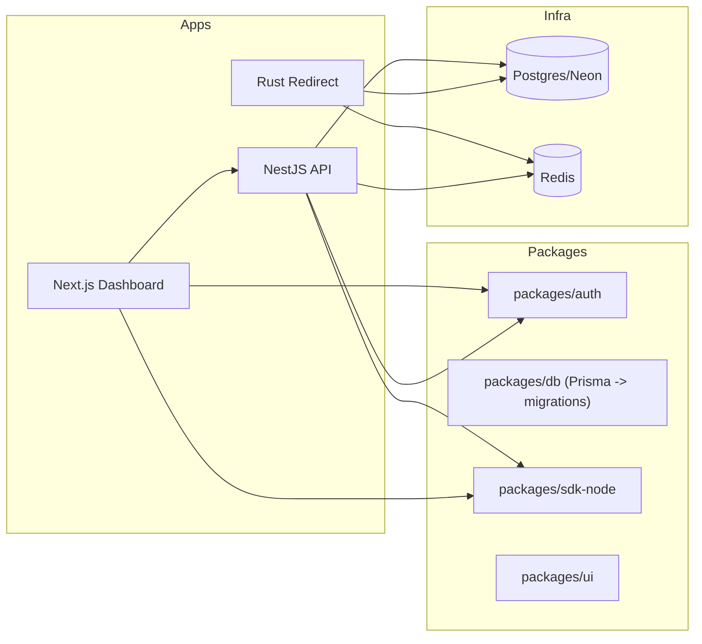
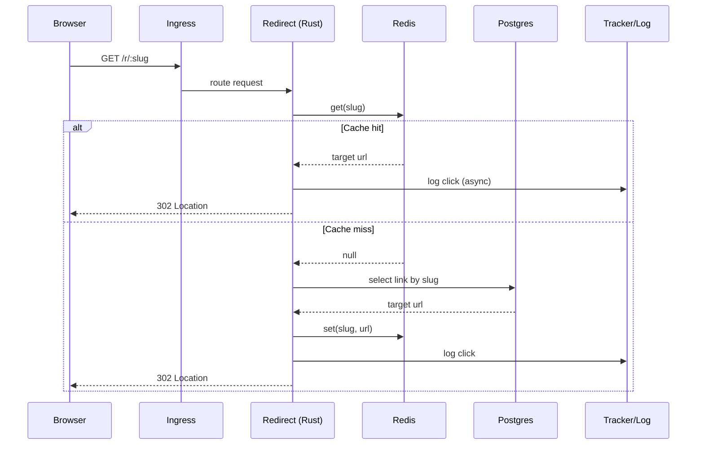
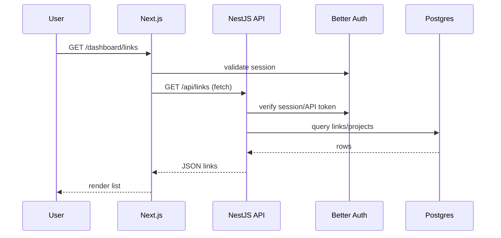
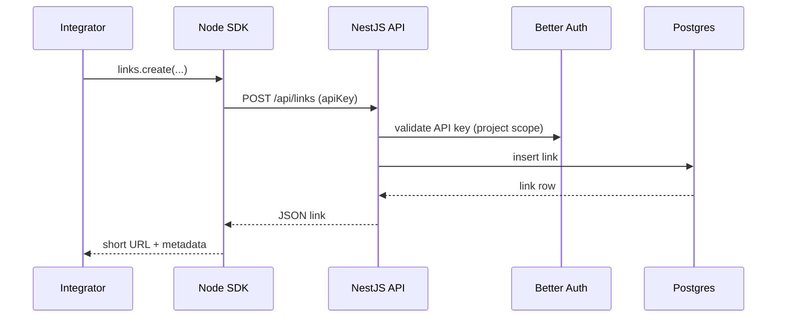

# Arc42 Architecture (vymalo-fyi)

This document follows the Arc42 structure for the redirect and tracking platform.

## Stack Assumptions

- Monorepo: Turborepo + pnpm.
- Frontend: Next.js (App Router) + Tailwind CSS + shadcn/ui + daisyUI + TanStack Query.
- Public API: NestJS.
- Hot path: Rust (Axum) + SQLx.
- Data: Postgres (Neon) + Redis.
- Auth: Better Auth (sessions and built-in API keys).
- ORM / Migrations: Prisma (schema + migrations), Drizzle (TS ORM), SQLx (Rust).
- Infra: Docker, Kubernetes (GKE), optional Knative for Rust redirects; db-migrator image + initContainers for migrations.

## 1. Introduction and Goals

### 1.1 Requirements Overview

- Short URLs and fast redirects.
- Analytics dashboard (click stats, referrers, geo/device breakdown).
- Public REST API and Node.js SDK.
- Multi-tenant projects/workspaces with roles (owner/admin/member).

### 1.2 Quality Goals

- Performance: p95 redirect latency - cache hit < 30 ms app time; cache miss < 80 ms app time.
- Developer productivity: single monorepo with shared types/tooling; new feature lead time measured in days.
- Reliability: 99.9% availability for redirect endpoints; safe DB migrations and rollbacks.

### 1.3 Stakeholders

- Product owner, backend engineers (NestJS/Rust), frontend engineers (Next.js), SRE/platform (GKE/Knative/Neon/Redis), end users, API integrators.

## 2. Architecture Constraints

- Languages: TypeScript (Next.js, NestJS) and Rust (redirect service).
- Frameworks: Next.js, NestJS, Axum (or Actix) with SQLx.
- Auth: Better Auth for sessions, social login options, and API-key issuance/rotation (avoids custom hashing logic).
- Database: Postgres (Neon); Prisma as schema and migration source of truth.
- Monorepo: Turborepo + pnpm workspaces.
- Deployment: Docker images to GKE; optional Knative for redirect autoscaling.
- Dependencies: prefer libraries updated within 12 months or widely adopted/stable.

## 3. System Scope and Context

### 3.1 Business Context

- Visitors click short links and are redirected.
- Dashboard users configure links, projects, and custom domains.
- API clients integrate via REST/Node SDK.
- Better Auth manages users/sessions/API keys; monitoring/logging stack collects metrics, traces, logs.

### 3.2 Technical Context

- Inbound via Kubernetes Ingress:
  - `/r/:slug` -> Rust redirect service.
  - `/api/*` -> NestJS API service.
  - `/*` -> Next.js dashboard (SSR/static assets).
- Outbound: Postgres (Neon), Redis (cache/rate limits), email/analytics providers (optional).

## 4. Solution Strategy

- Hybrid architecture: Rust for hot redirect path; NestJS for public API and business orchestration; Next.js for dashboard consuming the same API.
- Single API surface: external consumers call NestJS and public redirect URLs only.
- Single DB schema: Prisma defines schema and migrations; SQLx and Drizzle consume the generated schema (no ad-hoc migrations elsewhere).
- Better Auth unified auth: shared package for Next/Nest; built-in API keys reduce bespoke machine-auth code.
- OpenAPI from NestJS: feeds the generated Node SDK and shared contracts.

## 5. Building Block View

### 5.1 Monorepo Layout (illustrative)

```
/
|-- apps/
|   |-- web/           # Next.js dashboard
|   |-- api/           # NestJS public API
|   |-- redirect/      # Rust redirect service
|   `-- db-migrator/   # DB migration runner image
|
|-- packages/
|   |-- auth/          # Better Auth config + helpers for Next/Nest
|   |-- db/            # Prisma schema + migrations + Drizzle schema
|   |-- ui/            # Shared shadcn/ui + daisyUI components
|   |-- types/         # Shared domain & DTO types
|   |-- sdk-node/      # Generated Node client
|   `-- config/        # tsconfig/eslint/tailwind configs
|
`-- infra/
    |-- k8s/
    |-- docker/
    `-- ci/
```

### 5.2 Main Components



#### Rust Redirect Service (`apps/redirect`)

- Responsibilities: handle `/r/:slug`; use Redis read-through cache; write click events to DB/queue.
- Modules: `http` (Axum routes), `domain` (redirect logic), `infra` (SQLx repos, Redis client), `config` (env/logging).

Example:

```rust
// apps/redirect/src/http/handlers.rs
async fn redirect(
    Path(slug): Path<String>,
    Extension(state): Extension<AppState>,
) -> Result<impl IntoResponse, RedirectError> {
    if let Some(cached) = state.cache.get(&slug).await? {
        return Ok(Redirect::temporary(cached.target_url));
    }

    let link = state.repo.find_link_by_slug(&slug).await?;
    state.cache.set(&slug, &link.target_url).await?;
    state.tracker.log_click(&link.id, /* request metadata */).await?;

    Ok(Redirect::temporary(link.target_url))
}
```

#### NestJS API Service (`apps/api`)

- Responsibilities: public REST API (projects, links, stats, users, API keys), auth/authorization via Better Auth, OpenAPI for SDK, optional coordination with Rust.

```ts
// apps/api/src/links/links.module.ts
@Module({
  imports: [DbModule, AuthModule],
  controllers: [LinksController],
  providers: [LinksService],
})
export class LinksModule {}
```

#### Next.js Dashboard (`apps/web`)

- Responsibilities: manage links/projects/domains; Better Auth sessions; TanStack Query to call `/api/*`.

```tsx
// apps/web/app/dashboard/links/page.tsx
import { useQuery } from "@tanstack/react-query";
import { apiClient } from "@/lib/api-client";

export default function LinksPage() {
  const { data, isLoading } = useQuery({
    queryKey: ["links"],
    queryFn: () => apiClient.links.list(),
  });

  if (isLoading) return <div>Loading...</div>;

  return (
    <div>
      <h1 className="text-2xl font-semibold mb-4">Links</h1>
      <ul className="space-y-2">
        {data.items.map((link) => (
          <li key={link.id} className="card bg-base-200 p-4">
            <div className="font-mono">{link.shortUrl}</div>
            <div className="text-sm text-base-content/70">-> {link.targetUrl}</div>
          </li>
        ))}
      </ul>
    </div>
  );
}
```

#### `packages/db`

- Prisma schema and migrations; Drizzle schema mirroring Prisma; SQLx query fixtures and/or schema docs.

```prisma
// packages/db/prisma/schema.prisma (excerpt)
model User {
  id        String   @id @default(cuid())
  email     String   @unique
  name      String?
  createdAt DateTime @default(now())

  // Better Auth relations
  sessions  Session[]
  accounts  Account[]

  projects  Project[]
}

model Project {
  id        String   @id @default(cuid())
  name      String
  ownerId   String
  owner     User     @relation(fields: [ownerId], references: [id])
  links     Link[]
}

model Link {
  id        String   @id @default(cuid())
  slug      String   @unique
  targetUrl String
  project   Project  @relation(fields: [projectId], references: [id])
  projectId String
  createdAt DateTime @default(now())
}
```

## 6. Runtime View

### 6.1 Redirect Flow

Visitor hits `https://vym.fyi/r/abc123`:

1) Browser -> Ingress -> Rust redirect service.  
2) Rust checks Redis.
3) Cache hit: returns 302 and logs click asynchronously.
4) Cache miss: reads Postgres (SQLx), populates Redis, logs click, returns 302.



### 6.2 Dashboard View Flow

1) User loads `/dashboard/links` in Next.js.
2) Middleware/layout validates Better Auth session.
3) React Query calls NestJS `/api/links`.
4) NestJS validates session, loads data via Drizzle.
5) JSON returned; React Query renders list.



### 6.3 API Consumer Flow

```ts
import { createClient } from "@vymalo/fyi-node";
const client = createClient({ apiKey: process.env.REDIRECT_API_KEY });
await client.links.create({
  projectId: "proj_123",
  slug: "promo-2026",
  targetUrl: "https://some-website.example.com/landing",
});
```

1) SDK calls NestJS `/api/links`.
2) NestJS validates Better Auth API key and project permissions.
3) Link is stored; response returns canonical resource.



## 7. Deployment View

### 7.1 Artifacts

- Docker images (published to GHCR): `redirect-service:<tag>`, `api-service:<tag>`, `web-app:<tag>`, `db-migrator:<tag>`.
- Helm charts (published to GHCR OCI): one chart per service or a combined chart for app + ingress.
- npm packages: shared workspace packages (e.g., `packages/sdk-node`, `packages/ui`, `packages/types`).

### 7.2 Kubernetes (GKE) Setup

- Namespaces: `redirect-platform-prod`, `redirect-platform-staging`.
- Services: `redirect-service` (Rust, optional Knative), `api-service` (NestJS), `web-app` (Next.js).
- Ingress routes: `/r/*` -> redirect; `/api/*` -> API; `/*` -> web.

```mermaid
graph LR
  User((User))
  Ingress[Ingress]
  Redirect[Redirect svc (Rust)]
  API[NestJS API svc]
  Web[Next.js web]
  Redis[(Redis)]
  Postgres[(Postgres/Neon)]

  User --> Ingress
  Ingress -->|/r/*| Redirect
  Ingress -->|/api/*| API
  Ingress -->|/*| Web
  Redirect --> Redis
  Redirect --> Postgres
  API --> Postgres
  API --> Redis
```

### 7.3 InitContainers for Migrations

```yaml
apiVersion: apps/v1
kind: Deployment
metadata:
  name: api-service
spec:
  replicas: 3
  selector:
    matchLabels:
      app: api-service
  template:
    metadata:
      labels:
        app: api-service
    spec:
      initContainers:
        - name: db-migrate
          image: registry.example.com/db-migrator:latest
          envFrom:
            - secretRef:
                name: db-credentials
      containers:
        - name: api-service
          image: registry.example.com/api-service:latest
          envFrom:
            - secretRef:
                name: db-credentials
          ports:
            - containerPort: 3000
```

### 7.4 Build, Scan, and Release

- Targets: linux/amd64 and linux/arm64 for all container images.
- Rust: use `cross` to build release binaries for both arches before image packaging.
- Next.js and NestJS: use Docker Buildx (or CI matrix) to build multi-arch images.
- Security: scan every built image with Trivy before publishing.
- Publication:
  - Container images -> GHCR.
  - Helm charts -> GHCR OCI registry.
  - npm packages (workspace libs and SDK) -> npm registry.

## 8. Cross-Cutting Concepts

### 8.1 Authentication & Authorization

- Better Auth centralizes user/session management and issues API keys (rotation/expiration) without custom hashing logic.
- Next.js: Better Auth middleware + server helpers; sessions stored in Postgres via adapter.
- NestJS: validates Better Auth tokens/API keys via `packages/auth`; guards + decorators (`@UseGuards(AuthGuard)`, `@CurrentUser()`).
- Machine auth: Better Auth API keys bound to user/project; use Redis rate limits if needed.

### 8.2 Validation

- NestJS: DTOs with `class-validator` / `class-transformer`.
- Next.js: `zod` for forms and client validation.
- Rust: typed inputs and error enums mapped to HTTP codes.

### 8.3 Error Handling

- Standard NestJS envelope:

```json
{ "error": "BadRequest", "message": "Slug already exists", "statusCode": 400 }
```

- Rust: map domain errors to 4xx/5xx.
- Next.js: TanStack Query error boundaries + toasts.

### 8.4 Logging & Observability

- Structured logging: Rust `tracing`; NestJS `Logger`/pino-style.
- Metrics: request counts, latency, errors, cache hit ratio, DB timings.
- Tracing: OpenTelemetry across services.

### 8.5 Security

- TLS at ingress; secrets via K8s Secrets or GCP Secret Manager.
- Least privilege: separated read/write DB roles if needed.
- Rate limiting: Redis-backed per API key/IP.

## 9. Architecture Decisions (ADR Summary)

- ADR-001: Hybrid Rust + NestJS + Next.js (Rust for hot path, Next for dashboard, Nest for API).
- ADR-002: Prisma as schema/migration source of truth; Drizzle and SQLx consume it.
- ADR-003: Better Auth across services (sessions + API keys).
- ADR-004: Monorepo with Turborepo + pnpm for shared tooling.
- ADR-005: Separate db-migrator image for safer releases.
- ADR-006: Dependency freshness policy (well-maintained, up-to-date libs).

## 10. Quality Requirements / Scenarios

### 10.1 Performance

- Scenario: viral link (10k rps). Rust autoscaled via Knative/HPA; Redis hits dominate; Postgres protected with pooling and batched tracking. Success: 95% redirects < 50 ms (excl. network) and no DB exhaustion.

### 10.2 Availability

- Scenario: brief Neon outage. Cache hits keep working; cold slugs may 5xx with fallback page. Dashboard shows maintenance UI instead of crashing.

### 10.3 Evolution

- Scenario: add per-link A/B tests. Prisma schema change -> migration; Rust/Nest updated in one PR; feature toggles at project level.

## 11. Risks and Technical Debt

- Multi-ORM divergence (Prisma/Drizzle/SQLx). Mitigation: migrations only via Prisma; tests verify schemas.
- Auth edge cases across Next/Nest. Mitigation: shared `packages/auth`, end-to-end auth tests.
- Over-engineering early (three services). Mitigation: keep boundaries but run minimal replicas; avoid microservices inside each app.

## 12. Glossary

- Slug: short identifier mapped to a target URL.
- Link: redirect entry with slug, target URL, metadata.
- Project: container for a customer's links.
- Visitor: anonymous end user clicking a short URL.
- Better Auth: auth system managing users/sessions/API keys.
- DB-migrator: dedicated image that runs DB migrations before services start.
- HPA: Kubernetes Horizontal Pod Autoscaler.
- Knative: K8s extension for serverless-style autoscaling.

## 13. References

- Turborepo: <https://turborepo.com/docs>
- pnpm: <https://pnpm.io/>
- Next.js App Router: <https://nextjs.org/docs/app>
- Tailwind CSS: <https://tailwindcss.com/>
- shadcn/ui: <https://ui.shadcn.com/>
- daisyUI: <https://daisyui.com/>
- TanStack Query: <https://tanstack.com/query/latest/docs/framework/react/overview>
- NestJS: <https://nestjs.com>
- Axum: <https://docs.rs/axum/latest/axum/>
- SQLx: <https://github.com/launchbadge/sqlx>
- Postgres (Neon): <https://neon.com/>
- Redis: <https://redis.io/solutions/caching/>
- Better Auth (sessions & API keys): <https://www.better-auth.com/docs/introduction>
- Prisma: <https://www.prisma.io/orm>
- Drizzle ORM: <https://orm.drizzle.team/docs/overview>
- Docker: <https://docs.docker.com/>
- Kubernetes: <https://kubernetes.io/docs/home/>
- Knative: <https://knative.dev/docs/>
- OpenTelemetry: <https://opentelemetry.io/docs/specs/otel/overview/>
