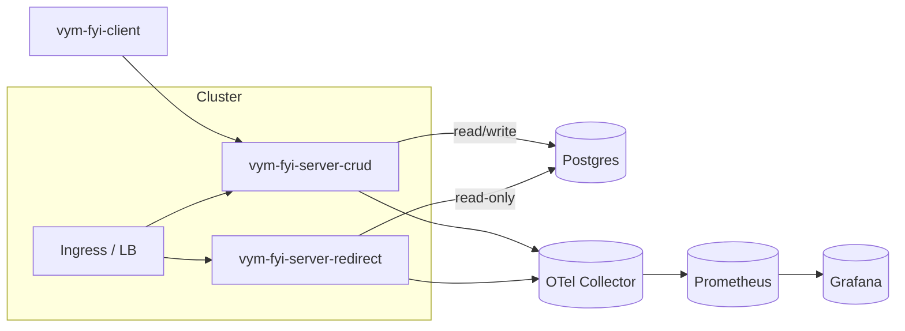

# Arc42 – vymalo-fyi URL Shortener

This document follows the Arc42 structure and describes the architecture of `vymalo-fyi`: a small, multi‑tenant URL shortener implemented purely in Rust.

The system consists of:

- `vym-fyi-server-redirect`: redirect server (read‑only access to Postgres).
- `vym-fyi-server-crud`: CRUD/API server (read/write access to Postgres).
- `vym-fyi-client`: CLI tool that talks to the CRUD server using API keys from `config.yaml`.
- `vym-fyi-model`: shared models and telemetry utilities.
- `vym-fyi-healthcheck`: simple health probe used in containers.

The services are packaged as containers and deployed on Kubernetes using the existing Dockerfile and Helm charts under `charts/`.

---

## 1. Introduction and Goals

### 1.1 Requirements Overview

- Shorten URLs and redirect users quickly to long target URLs.
- Support multiple independent clients/tenants, each identified by an API key.
- Provide a CRUD HTTP API for managing tenants, API keys, and short links.
- Provide a CLI (`vym-fyi-client`) that uses a `config.yaml` with multiple clients to call the CRUD API.
- Use a single Postgres database with:
  - A read‑only DB role used only by the redirect server.
  - A read/write DB role used only by the CRUD server.
- Expose a `/metrics` endpoint on both servers, suitable for Prometheus scraping and Grafana dashboards.
- Emit OpenTelemetry traces and metrics to an OTLP collector.

### 1.2 Quality Goals

- **Simplicity**: small number of binaries, minimal dependencies, and easy local/K8s operation.
- **Performance**: low latency redirect path (no heavy logic in redirect server).
- **Security**: isolation between tenants, strict separation of read‑only and read/write DB roles.
- **Observability**: metrics and traces available for all main flows, including per‑tenant usage where possible.
- **Operability**: predictable Docker/K8s deployment, health checks, and metrics endpoints.

### 1.3 Stakeholders

- **Operators / SREs**: deploy and operate the services on Kubernetes and configure monitoring/alerting.
- **API clients**: integrate against the CRUD API using API keys.
- **CLI users**: manage tenants and short links via `vym-fyi-client`.
- **Developers**: evolve the Rust code, DB schema, and observability.

---

## 2. Architecture Constraints

- **Language**: Rust (edition 2024) for all code in this repo.
- **Framework**: Axum + Tower/Hyper as the HTTP server stack for both CRUD and Redirect.
- **Database**: Postgres as the only persistent store.
- **Authentication**: API key–based machine auth only (no browser/session auth).
- **Tenancy**: single shared database schema with `tenant_id` on all tenant‑scoped data.
- **Metrics & tracing**:
  - OpenTelemetry SDK for traces and metrics (see `vym-fyi-model`).
  - `/metrics` endpoint per server for Prometheus scraping.
- **Deployment**:
  - Docker multi‑stage build via the root `Dockerfile` (targets `crud`, `redirect`, `healthcheck`).
  - Kubernetes deployment via Helm charts per server.

---

## 3. System Scope and Context

### 3.1 Business Context

- End users access short URLs and are redirected to long URLs.
- Each “client” of the system is modelled as a **tenant** with one or more API keys.
- Tenants manage their own short links via the CRUD API or via the CLI.

### 3.2 Technical Context

High‑level context:



- Inbound traffic:
  - `/api/*` → CRUD server.
  - `/r/*` or `/<slug>` → Redirect server (exact routing is configurable).
  - `/metrics` on each server → for Prometheus, not exposed publicly.
- Outbound traffic:
  - Both servers connect to Postgres using separate DB users.
  - Both servers send OTLP telemetry to an OpenTelemetry Collector.

---

## 4. Solution Strategy

- **Two backends**:
  - Redirect server:
    - Handles only read‑only lookups of short links.
    - Uses a read‑only Postgres role.
    - Exposes `/metrics` with basic counters and latency histograms.
  - CRUD server:
    - Provides REST endpoints to manage tenants, API keys, and short links.
    - Uses a read/write Postgres role.
    - Exposes `/metrics` with HTTP, DB, and per‑tenant metrics.
- **One CLI**:
  - `vym-fyi-client` reads a local `config.yaml` containing multiple `clients`.
  - Each client entry has a name, role, and API key (with optional `$(ENV_VAR)` placeholders).
  - The CLI chooses a client entry and calls the CRUD API with the appropriate API key.
- **Multi‑tenancy**:
  - Each tenant corresponds to a logical client using the system.
  - All tenant‑scoped data contains a `tenant_id` field.
  - API keys are bound to tenants and roles; the CRUD server enforces isolation by tenant.
- **Metrics & observability**:
  - All main flows are instrumented via OpenTelemetry and exported via OTLP.
  - `/metrics` exposes Prometheus‑compatible metrics on each server.

---

## 5. Building Block View

### 5.1 Workspace Structure

From `Cargo.toml`:

- `crates/vym-fyi-server-redirect`
- `crates/vym-fyi-server-crud`
- `crates/vym-fyi-client`
- `crates/vym-fyi-model`
- `crates/vym-fyi-healthcheck`

### 5.2 Responsibilities per Crate

- **vym-fyi-server-redirect**
  - Axum HTTP server for redirect endpoints.
  - Parses incoming requests into `{slug}` (optionally combined with host for multi‑tenant setups).
  - Uses a read‑only Postgres connection to resolve `slug` → `target_url`.
  - Emits redirect metrics and traces; exposes `/metrics`.

- **vym-fyi-server-crud**
  - Axum HTTP server for CRUD endpoints, for example:
    - `/api/tenants` – create/list tenants.
    - `/api/api-keys` – create/rotate/revoke API keys.
    - `/api/links` – manage short links.
  - Auth middleware:
    - Extracts API key from `X-API-Key` or `Authorization: ApiKey <key>`.
    - Resolves API key to `{tenant_id, role}`.
  - Enforces role‑based permissions (e.g. `admin` vs `url` role).
  - Uses a read/write Postgres connection.
  - Emits HTTP and DB metrics and traces; exposes `/metrics`.

- **vym-fyi-client**
  - CLI binary using `clap`.
  - Reads `config.yaml`, resolves any `$(ENV_VAR)` placeholders in `api_key`.
  - Provides commands to call CRUD endpoints (e.g. create/list links or tenants).

- **vym-fyi-model**
  - Shared domain structs (tenants, API keys, short links, errors).
  - Shared telemetry utilities (e.g. `otel.rs` to set up traces and metrics).
  - Shared HTTP client helpers and logging where appropriate.

- **vym-fyi-healthcheck**
  - Simple binary used in container `HEALTHCHECK` commands to verify the environment or connectivity.

---

## 6. Runtime View

### 6.1 Redirect Flow

1. User requests a short URL (e.g. `https://short.example.com/abc123`).
2. Ingress forwards the request to the Redirect server.
3. Redirect server:
   - Parses `slug` (`abc123`) from the request.
   - Queries Postgres using the read‑only pool for an active short link (and, if applicable, host‑scoped tenant).
   - Emits metrics (success/failure counters, latency) and tracing spans.
   - Returns an HTTP redirect (e.g. `302`) to the target URL.

### 6.2 CRUD Flow via CLI

1. User runs `vym-fyi-client` with a selected client id, for example:
   - `vym-fyi-client links create --client client-a --slug abc123 --target https://example.com`.
2. CLI:
   - Loads `config.yaml`.
   - Selects `clients.client-a`.
   - Resolves `api_key` by substituting any `$(ENV_VAR_NAME)` placeholders with environment variables.
   - Sends a request to `server.base_url` with the resolved API key in headers.
3. CRUD server:
   - Validates the API key and looks up `{tenant_id, role}`.
   - Checks authorization for the requested operation.
   - Executes the DB operation and returns JSON.
   - Emits metrics and tracing spans.

### 6.3 Metrics Flow

1. Both servers expose `GET /metrics` on their HTTP port.
2. Prometheus scrapes these endpoints at regular intervals.
3. Metrics are visualised in Grafana dashboards (e.g. per‑service, per‑route, per‑tenant where applicable).
4. In parallel, OpenTelemetry exports traces and metrics via OTLP to a collector.

---

## 7. Deployment View

### 7.1 Containers and Images

- Multi‑stage `Dockerfile` builds:
  - `vym-fyi-server-crud` (target: `crud`).
  - `vym-fyi-server-redirect` (target: `redirect`).
  - `vym-fyi-healthcheck`.
- Runtime images use `gcr.io/distroless/static-debian12:nonroot` for a minimal surface area.
- Containers are configured via environment variables.

### 7.2 Kubernetes and Helm

- Separate Helm charts for each server:
  - `charts/vym-fyi-server-crud`.
  - `charts/vym-fyi-server-redirect`.
- Typical K8s objects:
  - `Deployment` per server (with liveness/readiness probes using `vym-fyi-healthcheck` or HTTP health).
  - `Service` per server.
  - `Ingress` or IngressRoute mapping external paths/hosts to the two services.
- Metrics exposure:
  - `/metrics` is exposed on the same Service ports, scraped by Prometheus within the cluster.
  - Not exposed to the public internet.

### 7.3 Supporting Components

- Postgres instance (managed or in‑cluster).
- OpenTelemetry Collector for receiving OTLP from the Rust services.
- Prometheus for scraping `/metrics`.
- Grafana for dashboards.

---

## 8. Cross‑Cutting Concepts

### 8.1 Authentication & Authorization

- Authentication:
  - API keys are the only auth mechanism.
  - Clients send `X-API-Key: <key>` or `Authorization: ApiKey <key>`.
  - CRUD server stores only hashes of API keys in Postgres.
- Authorization:
  - Each API key is associated with a `tenant_id` and a `role`.
  - Minimal roles:
    - `admin`: full control of the tenant (manage keys, links, and tenant settings).
    - `url`: limited to link management only.
  - Permission checks are centralised in helper functions, not scattered across handlers.

### 8.2 Tenancy

- Tenants represent isolated clients using the system.
- Every short link belongs to exactly one tenant.
- CRUD server derives `tenant_id` from the API key.
- Redirect server does not receive explicit tenant information in the path; it looks up the slug (and optionally the host) and reads the corresponding row, which includes `tenant_id`.

### 8.3 Configuration and `config.yaml`

The CLI is configured via a YAML file with multiple clients. Example:

```yaml
server:
  base_url: https://crud.example.com
  master_api_key: "$(MASTER_API_KEY)"  # optional

clients:
  client-a:
    name: my-cli-client-a
    api_key: "$(CLIENT_A_SECRET)"
    role: admin

  client-b:
    name: my-cli-client-b
  api_key: "$(CLIENT_B_SECRET)"
  role: url
```

- `server.base_url`: URL of the CRUD server.
- `clients`: map of client ids; each id represents a client/tenant from the CLI perspective.
- `api_key`:
  - May contain placeholders like `$(CLIENT_A_SECRET)`.
  - At runtime, the CLI replaces each `$(NAME)` with the value of environment variable `NAME`.
  - This allows storing API keys in environment variables instead of on disk.
- `server.master_api_key`:
  - Optional master key for administrative operations (such as managing tenants or keys from the CLI).
  - Also supports `$(ENV_VAR_NAME)` placeholders and is resolved in the same way.

Server configuration is driven by environment variables, which are defined in deployment manifests and Helm values (e.g. DB URLs, OTLP endpoint, log level).

### 8.4 Observability

- Tracing:
  - `vym-fyi-model` provides OpenTelemetry setup.
  - Each request is wrapped in a span; tenant id and route info can be attached as attributes.
- Metrics:
  - HTTP request counters and latency histograms per route.
  - Redirect hit/miss counts.
  - Basic DB metrics (errors, timeouts).
  - Exposed via `/metrics` and exported via OTLP.

---

## 9. Glossary

- **Tenant**: logical client of the system; owns short links and API keys.
- **Client (CLI)**: entry in `config.yaml` corresponding to a tenant and an API key.
- **Slug**: short identifier in a URL, mapped to a target URL.
- **CRUD server**: `vym-fyi-server-crud` binary exposing the management API.
- **Redirect server**: `vym-fyi-server-redirect` binary resolving and redirecting short URLs.
- **API key**: secret used to authenticate a client; bound to a tenant and role.
- **/metrics**: HTTP endpoint exposing Prometheus‑compatible metrics.
- **OTLP**: OpenTelemetry protocol for exporting traces and metrics to a collector.
